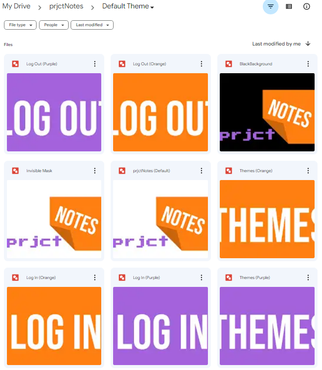
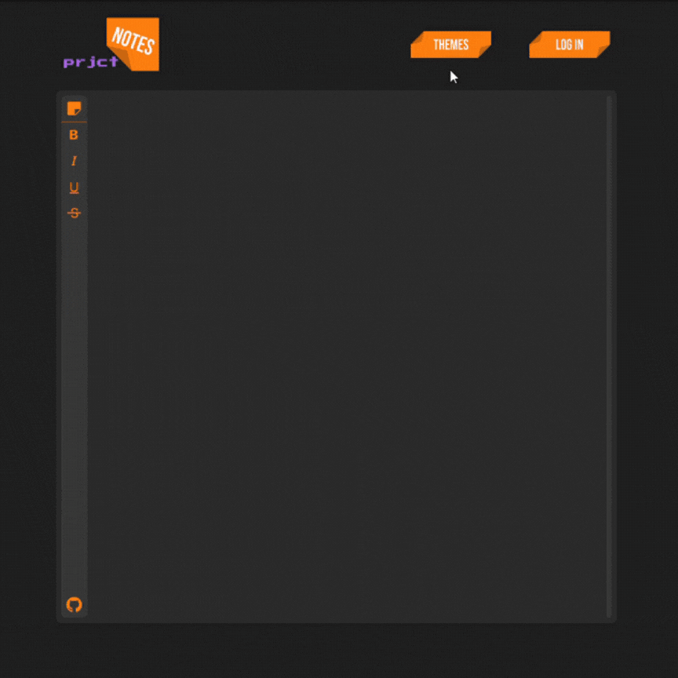
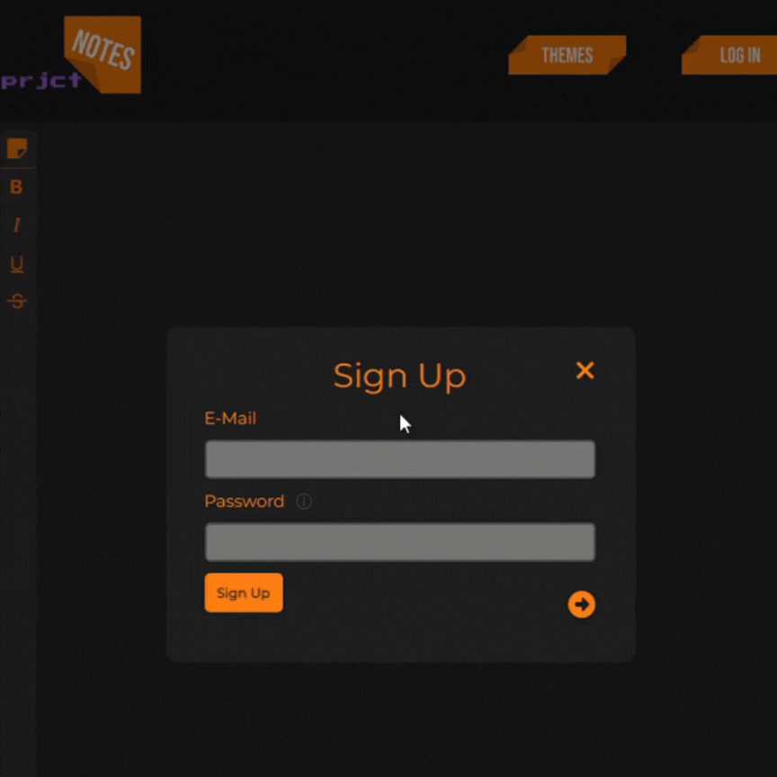
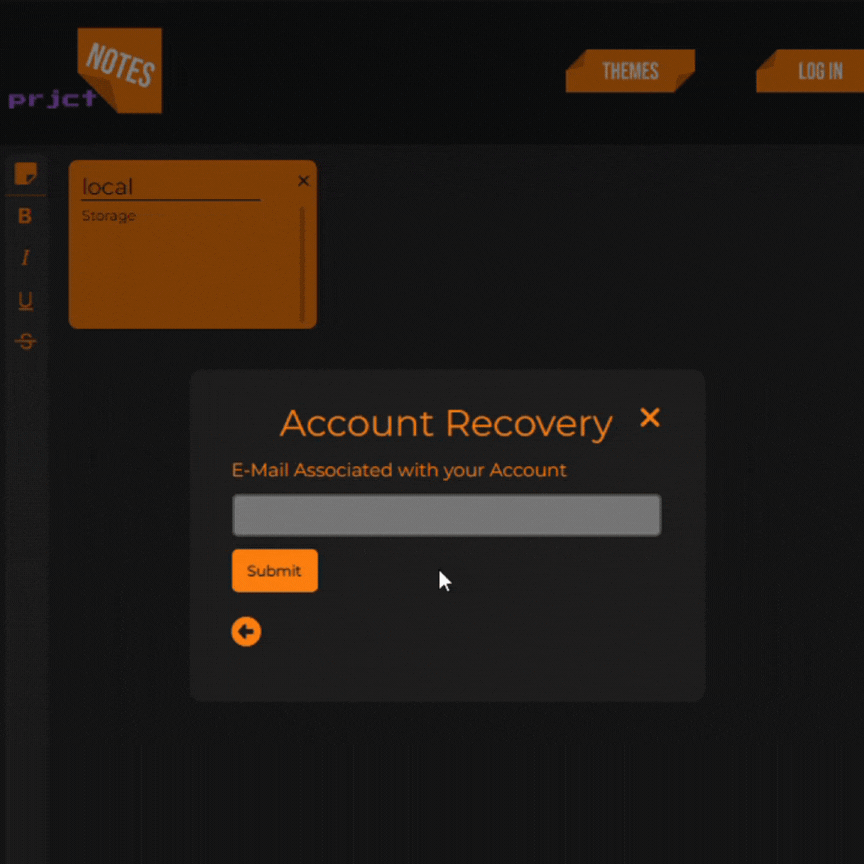

# :memo: [prjctNotes](https://prjctnotes.com/)
Welcome to the github repository for prjctNotes. It is a note taking web application I developed through the use of AWS for the backend and HTML, CSS and JavaScript for the frontend.

While this may be just another note taking app in another portfolio, I started this as my first project and realized partway through that this may have been a generic/common project, but I felt it would be better to complete what I had started than to abandon it. In this project, I chose to focus on the backend functionality to further develop my understanding of AWS and get comfortable working with its services.

## :globe_with_meridians: Overview

In the overview I while provide general descriptions and screenshots/GIFs of how I went about creating this website!

### :star2: Aesthetics

When you go to a web page, the first thing your eyes are drawn to are the colours, the shapes and the overall design. I wanted to create an appealing design so for the first few days I spent just sketching ideas and coming up with colour schemes. The default colour scheme you see when you first load into the site is the one I finalized, and the other two choices came later in development.

I created all the logos and buttons used on the site using Google Drawings and there was an extensive use of CSS and JavaScript to make the buttons and transitions behave exactly how I wanted them to.

  
Screenshot of Google Drive with the Logos and Buttons I Made

  

  
Log In Interface Transitions Demo

  

### :hammer_and_wrench: Functionality

The website features a 'sign up', 'log in' and 'forgot password' interface, the ability to quickly change your desired theme, a rich text editor for your notes and lastly a local and cloud storage option for your notes and your chosen theme. I did not use any frameworks or extensions for the frontend as everything was written in VanillaJS, so for example, instead of using something like Quill for my rich text editor, it was custom made. 

  
Changing Themes Demo

  

  
Rich Text Editor Demo

  

  
Sign Up Demo

  

  
Log In Demo

  

  
Forgot Password Demo

  

### :satellite: AWS

Here I will dive a little deeper on what AWS services I used and how they were implemented.

-  AWS DynamoDB was used to save user profiles with their saved notes and theme of choice. I used a hash key (their e-mail) and range key (the context of data ex. 'password', 'saved' and 'theme') to seperate and organize the entries by their context.

-  AWS Lambda functions were used as the link between the frontend and the database. I created Lambda functions with function URLs and used the JavaScript Fetch API to communicate with these Lambda functions. All but one of the Lambda functions strictly worked with only the DynamoDB table and that function was the 'forgot password' function. The function checked if the e-mail existed in the database and if it did, it would utilize the Python smtplib module to send that e-mail information about the forgotten password.

-  AWS Parameter Store was used to securely save and retrieve the 16-digit app password for the Gmail that was being used by the smtplib module to send the e-mail.

-  Terraform was used to initialize and create AWS resources as well as assign IAM roles and policies to the necessary resources.
